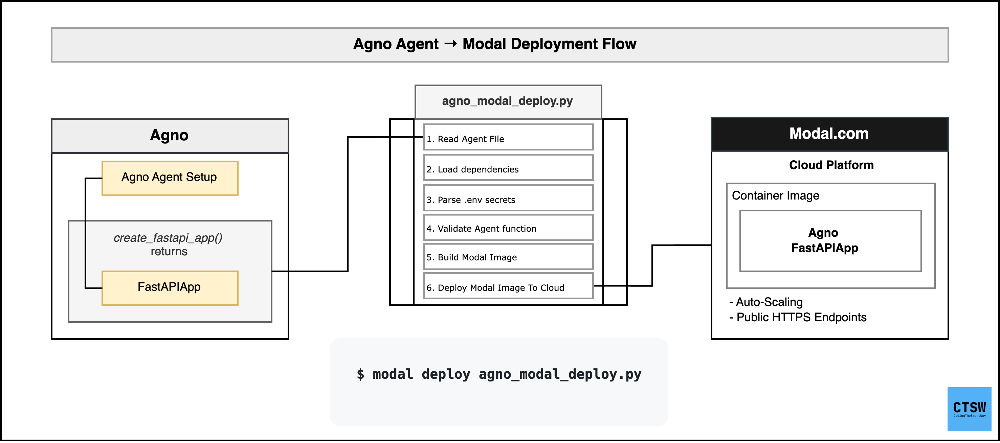

# Deploying Agno Agents to Modal with FastAPIApp

This repository demonstrates how to easily deploy any Agno agent to Modal cloud platform using a generic deployment script. The `agno_modal_deploy.py` script handles all the complexity of Modal deployment, making it simple to get your Agno agents running in the cloud.

## 📊 Deployment Overview

The deployment process is straightforward: the script takes your Agno agent, packages it with all dependencies, and deploys it to Modal's cloud platform. Your agent becomes instantly available via a REST API endpoint, ready to handle requests from anywhere.




## 🎥 See It In Action

Check out this quick demo of deploying a financial analysis agent to Modal. The deployment takes just seconds, and you can start making API calls right away!


## 🎯 What You'll Learn

- How to deploy Agno agents to Modal in minutes
- How to use the generic `agno_modal_deploy.py` script for any agent
- How to manage dependencies and secrets automatically
- How to interact with your deployed agent via API

## 📋 Prerequisites

1. **Modal Account**: Create a free account at [modal.com](https://modal.com)
2. **Modal CLI**: Install and authenticate Modal
3. **Python Environment**: Python 3.8+ with your Agno agent dependencies

### Setting Up Modal

```bash
# Install Modal
pip install modal

# Authenticate with Modal (creates account if needed)
modal setup
```

## 🚀 Quick Start

### Step 1: Prepare Your Agent

Your Agno agent file must have a `create_fastapi_app()` function that returns a `FastAPIApp` instance:

```python
# your_agent.py
from agno.agent import Agent
from agno.app.fastapi.app import FastAPIApp
from agno.models.openai import OpenAIChat

def create_fastapi_app() -> FastAPIApp:
    """
    Create a FastAPI app with your agent.
    This function must be self-contained and handle both agent creation
    and FastAPI app setup.
    """
    # Create your agent
    agent = Agent(
        name="Your Agent",
        model=OpenAIChat(id="gpt-4o"),
        # ... your agent configuration
    )
    
    # Create and return FastAPI app
    return FastAPIApp(agent=agent)
```

### Step 2: Create Dependencies File

Create a `requirements.txt` file with all your dependencies:

```bash
# Generate requirements.txt from your current environment
pip freeze > requirements.txt

# Or manually create with your dependencies
echo "agno>=1.5.0" > requirements.txt
echo "openai>=1.82.0" >> requirements.txt
echo "fastapi>=0.115.0" >> requirements.txt
# ... add other dependencies
```

### Step 3: Configure API Keys (Optional)

Set up your API keys for automatic secret management:

```bash
# Copy the example environment file
cp .example.env .env

# Edit .env and replace placeholder values with your actual API keys
# .env
OPENAI_API_KEY=sk-your-actual-openai-key
ANTHROPIC_API_KEY=your-actual-anthropic-key
GROQ_API_KEY=your-actual-groq-key
# ... add other API keys as needed
```

**Note**: The `.example.env` file contains placeholder values and is safe to commit to git. Your actual `.env` file with real API keys should never be committed (it's already in `.gitignore`).

### Step 4: Configure Deployment Script

Edit the `AGENT_FILE` variable in `agno_modal_deploy.py`:

```python
# ============================================================================
# CONFIGURATION - Edit this to point to your agent implementation file
# ============================================================================
AGENT_FILE = "your_agent.py"  # Change this to your agent file
# ============================================================================
```

### Step 5: Deploy to Modal

```bash
# Development deployment (with hot reloading)
modal serve agno_modal_deploy.py

# Production deployment
modal deploy agno_modal_deploy.py
```

That's it! Your agent is now deployed and accessible via a public URL.

## 📖 Detailed Walkthrough

### Understanding the Deployment Script

The `agno_modal_deploy.py` script is a generic deployment solution that:

1. **Auto-detects your agent** from the `AGENT_FILE` configuration
2. **Loads dependencies** dynamically from `requirements.txt`
3. **Manages secrets** automatically from `.env` file
4. **Configures Modal** with optimal settings for Agno agents
5. **Deploys your agent** as a scalable web service

### How It Works

#### 1. Agent Detection and Validation

```python
# The script reads your agent file name
AGENT_FILE = "financial_agent_app.py"
agent_file_path = Path(AGENT_FILE)

# Validates the file exists
if not agent_file_path.exists():
    raise FileNotFoundError(f"Agent file not found: {agent_file_path}")

# Uses filename as Modal app name
APP_NAME = agent_file_path.stem  # "financial_agent_app"
```

#### 2. Dependency Management

The script automatically reads your `requirements.txt` file:

```python
def load_requirements():
    # Ensures GitPython is always included (required by Agno)
    dependencies.add("GitPython")
    
    # Reads and parses requirements.txt
    with open(requirements_file, 'r') as f:
        for line in f:
            # Handles comments, editable installs, etc.
            # Adds valid dependencies to the list
```

**Key Features:**
- ✅ **Mandatory requirements.txt** - No fallback dependencies
- ✅ **GitPython auto-included** - Always ensures Agno compatibility
- ✅ **Smart parsing** - Handles comments, editable installs, recursive requirements
- ✅ **Error handling** - Clear messages if file is missing or invalid

#### 3. Secret Management

The script uses Modal's built-in `.env` file support:

```python
# Checks if .env file exists
has_env_file = load_env_file()

# Uses Modal's from_dotenv() for automatic secret injection
secrets=[modal.Secret.from_dotenv()] if has_env_file else []
```

**Benefits:**
- ✅ **Automatic** - No manual secret creation needed
- ✅ **Secure** - Secrets are encrypted and managed by Modal
- ✅ **Simple** - Just create a `.env` file with your API keys
- ✅ **Optional** - Works without secrets (with warnings)

#### 4. Modal Configuration

The script configures Modal with optimal settings for Agno agents:

```python
@app.function(
    image=image,
    max_containers=10,        # Scale up to 10 containers
    min_containers=1,         # Keep 1 container warm
    timeout=300,              # 5-minute timeout
    secrets=[...],            # Auto-injected from .env
)
```

#### 5. Dynamic Import and Deployment

```python
def fastapi_app():
    # Dynamically imports your agent module
    agent_module = importlib.import_module(AGENT_MODULE)
    
    # Calls your create_fastapi_app() function
    fastapi_app = agent_module.create_fastapi_app()
    
    # Returns the FastAPI app for Modal to serve
    return fastapi_app.get_app()
```

## 🛠 Customization Options

### Environment Variables

You can customize deployment behavior with environment variables:

```bash
# Deployment configuration
MAX_CONTAINERS=20 modal deploy agno_modal_deploy.py    # Scale to 20 containers
MIN_CONTAINERS=2 modal deploy agno_modal_deploy.py     # Keep 2 containers warm
TIMEOUT=600 modal deploy agno_modal_deploy.py          # 10-minute timeout
MAX_CONCURRENT=200 modal deploy agno_modal_deploy.py   # 200 concurrent requests
```

### Multiple Agents

Deploy different agents by changing the `AGENT_FILE`:

```python
# For a trading bot
AGENT_FILE = "trading_bot.py"

# For a research assistant
AGENT_FILE = "research_assistant.py"

# For a financial advisor
AGENT_FILE = "financial_agent_app.py"
```

## 🌐 Using Your Deployed Agent

Once deployed, Modal provides you with a public URL. You can interact with your agent using:

### API Endpoints

- **POST `/v1/run`** - Main agent interaction endpoint
- **GET `/health`** - Health check
- **GET `/docs`** - Interactive API documentation
- **GET `/redoc`** - Alternative API documentation

### Example API Usage

```bash
# Basic chat request
curl -X POST https://your-deployment-url.modal.run/v1/run \
  -F "message=What is the current stock price of AAPL?" \
  -F "stream=false"

# Streaming response
curl -X POST https://your-deployment-url.modal.run/v1/run \
  -F "message=Analyze the market trends" \
  -F "stream=true"

# With session for conversation continuity
curl -X POST https://your-deployment-url.modal.run/v1/run \
  -F "message=Hello, I need investment advice" \
  -F "stream=false" \
  -F "session_id=my-session-123"
```

### Python Client Example

```python
import requests

# Your Modal deployment URL
BASE_URL = "https://your-deployment-url.modal.run"

# Send a message to your agent
response = requests.post(
    f"{BASE_URL}/v1/run",
    files={
        "message": (None, "What are the top tech stocks to watch?"),
        "stream": (None, "false")
    }
)

print(response.json())
```

## 📊 Example: Financial Agent

This repository includes a complete example of a financial analysis agent:

### Agent Features (`financial_agent_app.py`)

- **Real-time stock prices** using YFinance
- **Company fundamentals** and financial ratios
- **Analyst recommendations** and price targets
- **Recent company news** and market developments
- **GPT-4o powered analysis** for sophisticated insights

### Deployment

```bash
# The agent is already configured in agno_modal_deploy.py
modal deploy agno_modal_deploy.py
```

### Usage Examples

```bash
# Stock analysis
curl -X POST https://your-url.modal.run/v1/run \
  -F "message=Analyze Tesla (TSLA) stock performance" \
  -F "stream=false"

# Market comparison
curl -X POST https://your-url.modal.run/v1/run \
  -F "message=Compare Apple vs Microsoft for investment" \
  -F "stream=false"

# Portfolio advice
curl -X POST https://your-url.modal.run/v1/run \
  -F "message=Should I invest in NVIDIA right now?" \
  -F "stream=false"
```

## 🔧 Troubleshooting

### Common Issues

1. **Agent file not found**
   ```
   ❌ Agent file not found: your_agent.py
   ```
   **Solution**: Ensure your agent file exists and `AGENT_FILE` is correct

2. **Missing requirements.txt**
   ```
   ❌ requirements.txt not found
   ```
   **Solution**: Create requirements.txt with `pip freeze > requirements.txt`

3. **Missing create_fastapi_app function**
   ```
   ❌ Agent module must have a 'create_fastapi_app()' function
   ```
   **Solution**: Add the required function to your agent file

4. **API key errors**
   ```
   ⚠️ Warning: No .env file found during deployment
   ```
   **Solution**: Create `.env` file with your API keys

## 🤝 Contributing

Feel free to improve this deployment script or add more examples! The goal is to make Agno agent deployment as simple as possible for everyone.

## 📄 License

This project is open source and available under the MIT License.
